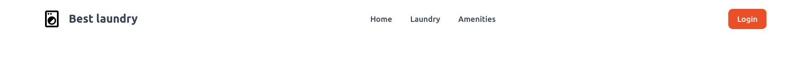
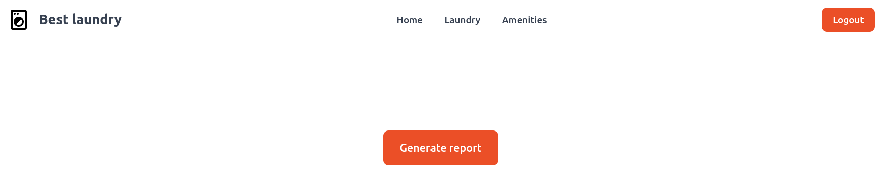
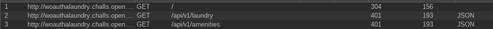
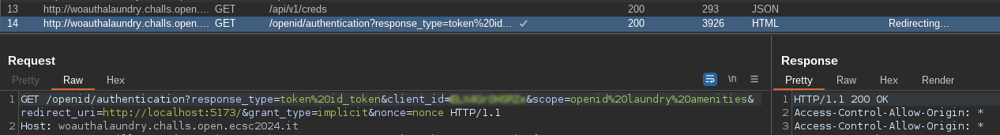
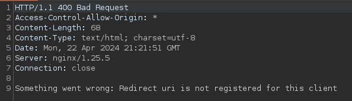
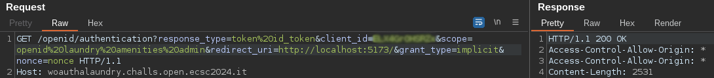
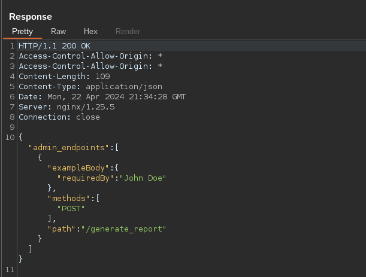
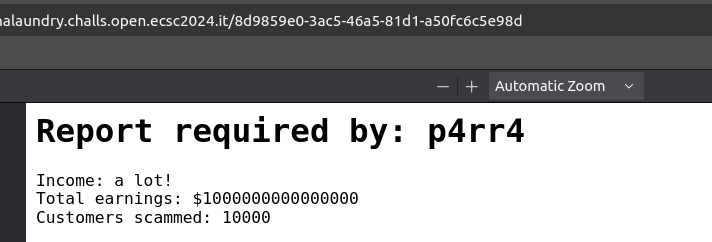
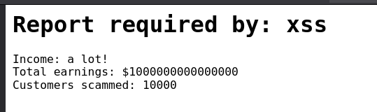
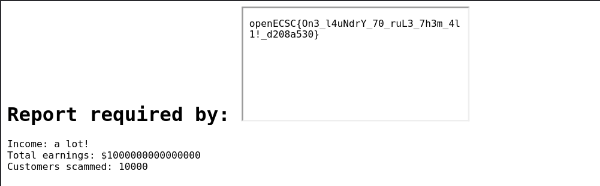

## Challenge description

> Welcome to our innovative business, the only ONE Laundry capable of completely sanitize your clothing by removing 100% of bacteria and viruses. Flag is in `/flag.txt`.

> Site: http://woauthalaundry.challs.open.ecsc2024.it

## Overview

Unlike other web challenges, we are not given the source code nor the docker of the remote server. The web app is pretty simple:



It has some options and a login. We initially cannot interact with any of the present options (`/laundry` and `/amenities`) but we can log in. When we click, we are automatically logged in without the need to introduce creds, and can then see both pages. However, they are just static pages with images. Nothing interesting until now, however, we can find something promising when we look at the source code:

```html
<script>
    {
        __sveltekit_1ukpbqx = {
            base: new URL(".", location).pathname.slice(0, -1)
        };

        const element = document.currentScript.parentElement;

        const data = [null,null];

        Promise.all([
            import("./_app/immutable/entry/start.n8speICZ.js"),
            import("./_app/immutable/entry/app.Ck9duSk9.js")
        ]).then(([kit, app]) => {
            kit.start(app, element, {
                node_ids: [0, 2],
                data,
                form: null,
                error: null
            });
        });
    }
</script>
```

After some googling, I found out that the app appears to be using the Svelte framework. It also seems to be importing some JavaScript files. When looking at `app.Ck9duSk9.js`, we can see a bunch of JavaScript code, but the following string stands out:

```js
fe={"/":[2],"/admin":[3],"/amenities":[4],"/laundry":[5]}
```

Yay, there is an Admin page!

## Admin panel

There is a new option to **generate a report**. However, we cannot interact with it yet.



Now I will fire up BurpSuite to take a closer look at how the app works.

## API

BurpSuite reveals that the app interacts with an API when loading the pages:



At first sight, it performs `GET` requests to load each of the pages that we are presented initially. As it can be seen, we are receiving a `401 Unauthorized` as we are not yet logged in. Now we proceed logging in:



We see a request to a `creds` endpoint that returns a JSON object containing a `client_id` and a `client_secret`, and just after that a quite interesting request to an `OpenID` authorization endpoint with very promising parameters! This seems to give us an Authorization Bearer token that lets us access the pages of the app. If we try accessing `/admin`, we will see a request to `/api/v1/admin`, resulting in another `401 Unauthorized`.

The creds request seems to be related with the [OAuth](https://portswigger.net/web-security/oauth) framework. Inside the OpenID request, we can see several probably vulnerable parameters: `redirect_uri` and `scope`. We also have a `nonce` param that is insecure as it is weak and reused every time we perform a request to get a token, but we will focus on the other two.

### Redirect_uri

The `redirect_uri` param seems to be sanitised, as it does not let us perform requests to other endpoints, access internal resources or modify the redirect:



### Scope

The `scope` param contains the name of the API endpoints (`/api/v1/{endpoint}`) that it is giving us access to: `openid`, `laundry` and `amenities` (separated by URL encoded spaces). Now, we need to gain access to `/admin`, which visits `/api/v1/admin`, let's try adding that endpoint:



It does seem to work! Let's intercept the creds request and modify it.



There we go, we are able to access the admin panel!

## Generate report

As seen in the above request, we have access to the `generate_report` endpoint that receives a `requiredBy` parameter via `POST` request. Let's give it a try:



When intercepting the request and adding the parameter, it generates a PDF report with our input. If we download the PDF:

```bash
❯ strings document.pdf | head -10
%PDF-1.4
1 0 obj
<</Title (Report)
/Creator (Chromium)
/Producer (Skia/PDF m124)
*SNIP*
```

We discover that it is created using `Skia/PDF`, which uses a backend that can render HTML as images and PDFs. After a bit of research, trying to look for vulnerabilities of this specific backend, I stumbled across this [Hacktricks page](https://book.hacktricks.xyz/pentesting-web/xss-cross-site-scripting/server-side-xss-dynamic-pdf) talking exactly about Server Side XSS in dynamic PDFs.

### Server-Side XSS

The goal is to make the server's backend interpret our input as HTML tags and JavaScript code so that it is executed when rendered. I am going to create a payload to test it:

```html
<script>document.write('xss')</script>
```



## Flag

The final step is to craft a payload to read the flag. In my case, I chose to use an `iframe` tag:

```html
<iframe src=file:///flag.txt></iframe>
```



Flag: `openECSC{On3_l4uNdrY_70_ruL3_7h3m_4l1!_d208a530}`